# Component Interaction Diagrams

This document provides visual representations of how different components in the Modern SaaS Template interact with each other.

## System Component Overview

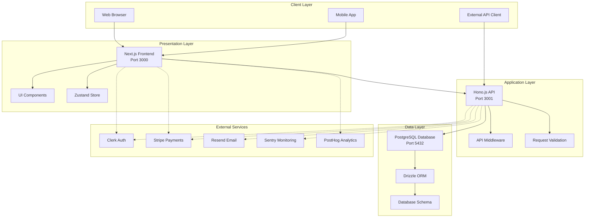

## Authentication Flow

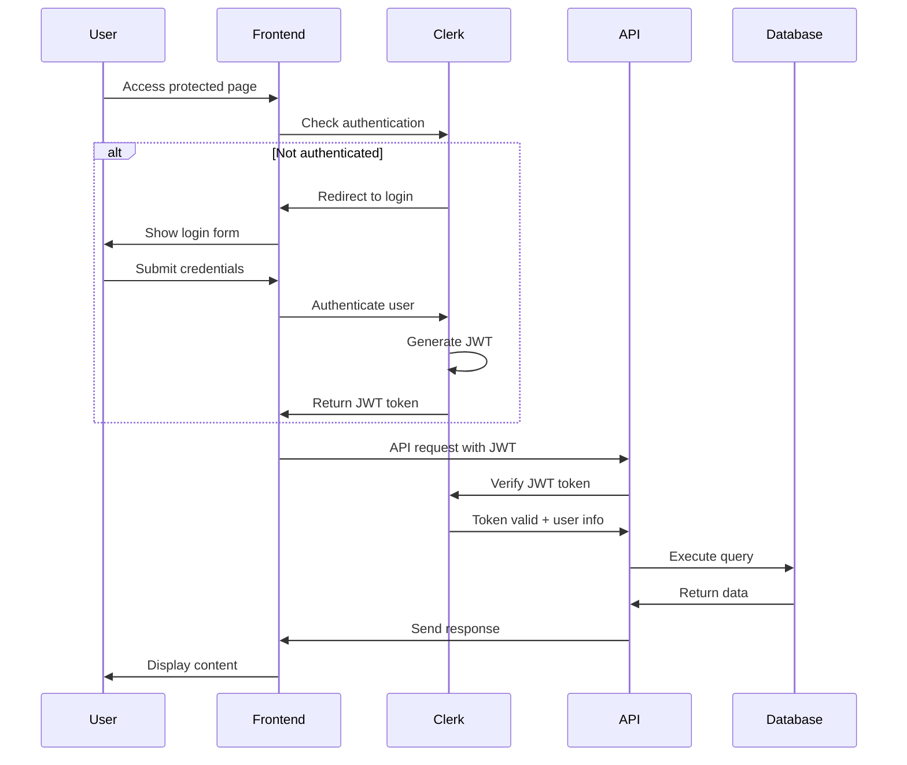

## Payment Processing Flow

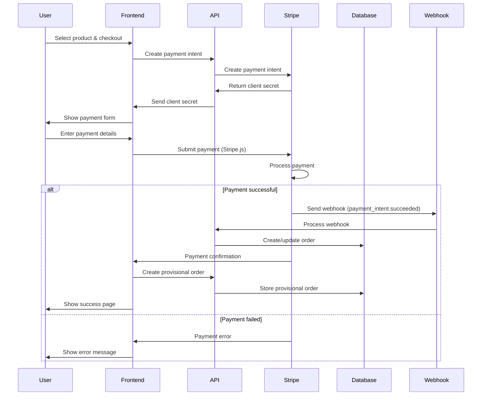

## Order Management Flow

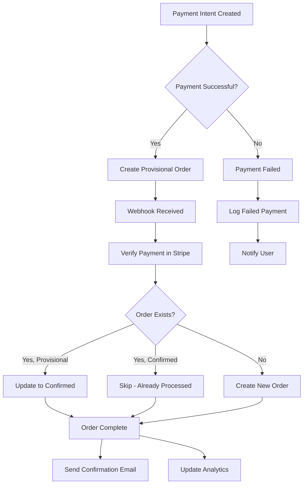

## Database Entity Relationships

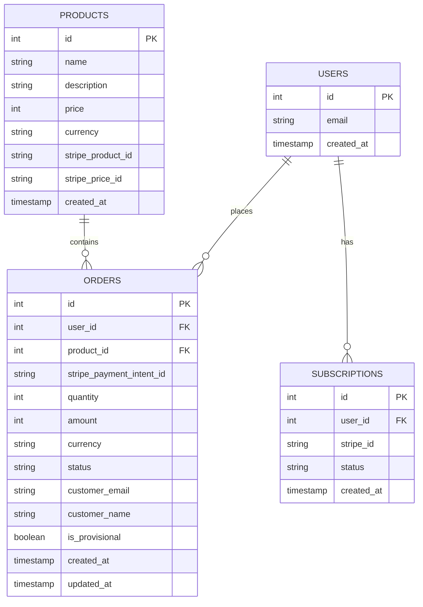

## API Request Flow

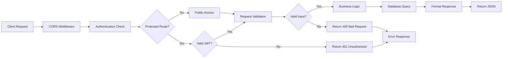

## Development Environment Architecture

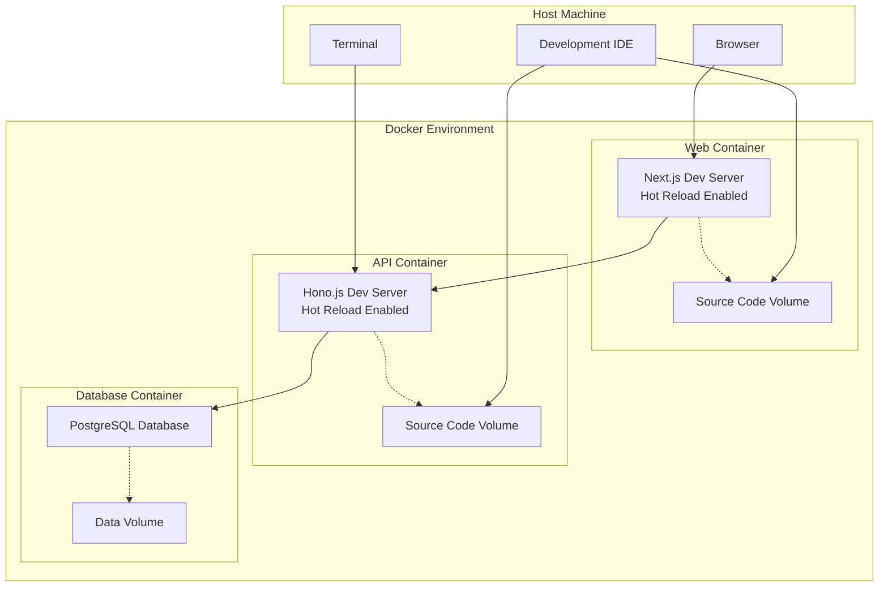

## Deployment Architecture

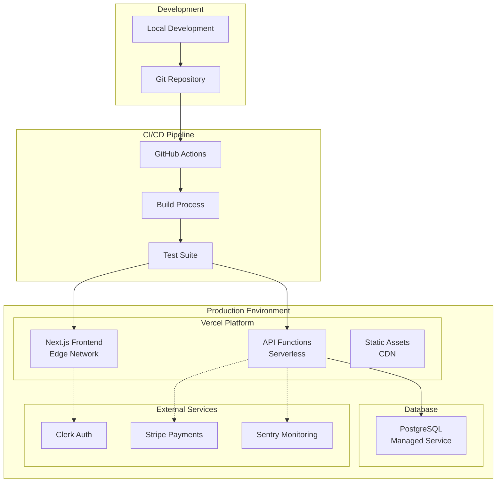

## State Management Flow

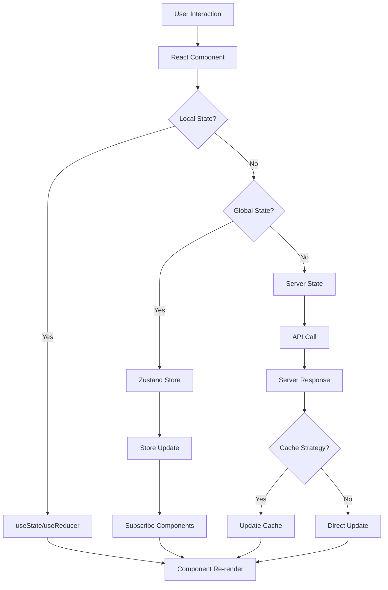

## Error Handling Flow

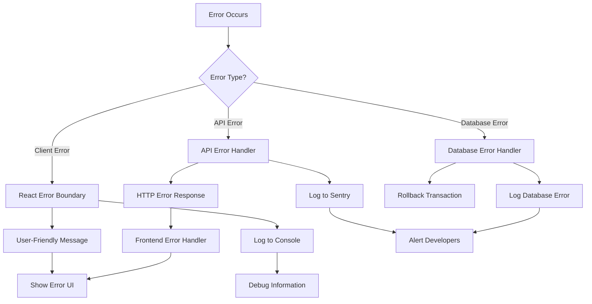

## Security Architecture

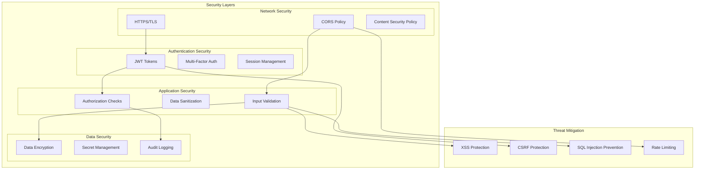

These diagrams provide a visual representation of how the various components in the Modern SaaS Template interact with each other, making it easier to understand the system architecture and data flow patterns.